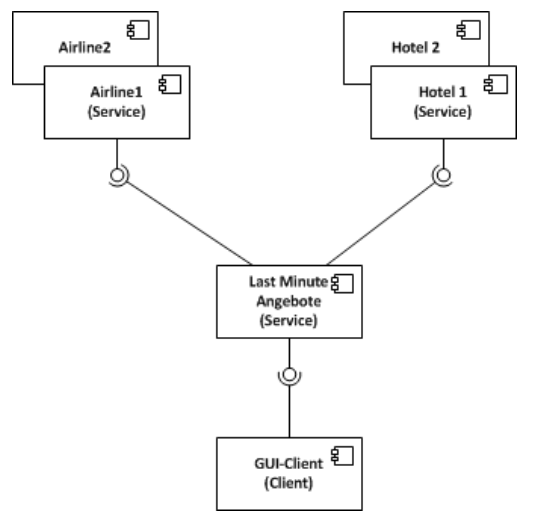

# OOP2 - Norm Case Study verteilte Systeme
## Aufgabestellung

Die Zeiten sind hart für Fluggesellschaften… Billiganbieter drücken auf die Preise, dadurch sinkt die
Auslastung in unseren Flugzeugen.

Gleichzeitig beklagen sich Hotelbesitzer über leere Betten....

Unser innovatives Konzept könnte hier Abhilfe schaffen.

Wir planen den Aufbau eines verteilten Systems mit welchen die Fluggesellschaften ihre unbelegten
Sitze und die Hotels ihre unbelegten Zimmer in Last Minute Angebote umwandeln können, welche
anschließend auf unserer Plattform angeboten resp. verkauft werden.

Wir gehen dabei wie folgt vor:

Anhand der durch die Hotels angemeldeten freien Zimmer suchen wir bei den Fluggesellschaften
nach passenden Flügen und vermerken das in unserer Datenbank.

Die so erstellten Kombiangebote vermerken wir ebenfalls in unserer Datenbank.
Diese kann von einem (WinForm oder WPF) Client abgefragt werden, bei Gefallen können auch
Buchungen vorgenommen werden.

Diese werden bei uns zur Auslösung der Zahlungen verwendet und dienen gleichzeitig dazu, bei den
Anbietern die entsprechenden Buchungen resp. Reservationen vorzunehmen (nicht Teil der
Applikation)

## Projektplan

## Stakeholder
## Usecases
overview pic mit Muss/Wunschziele
### UC1 - So und so

| USE CASE # | UC1 - So und so ||
| --- | --- | --- |
|Goal in Context|
|Scope & Level|
|Preconditions|
|Success End Condition|
|Failed End Condition|
|Primary, 
Secondary Actors|
|Trigger|
|DESCRIPTION|Step|Action|
| |1|blabla|
|EXTENSIONS|Step| Branching Action|
| |1a|blabla|
## 
### Doc
#### Doc
##### Doc
###### Doc
####### Doc